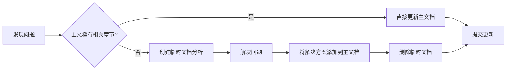
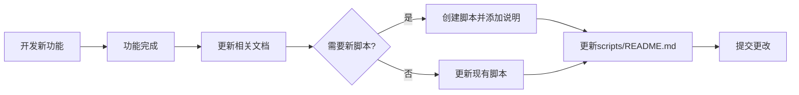

# 📝 文档维护指南

本指南说明如何管理 FastGPT 项目的文档和脚本,保持项目清晰有序。

## 📁 当前文档结构

```
d:\FastGPT\
│
├── 📖 核心文档 (根目录)
│   ├── DEPLOYMENT_GUIDE.md              ⭐ 部署指南 (快速入口)
│   ├── DOCKER_DEPLOYMENT_SOLUTION.md     ⭐ 完整部署方案
│   ├── BUILD_ISSUES_ANALYSIS.md          构建问题分析
│   ├── README.md                         官方README (勿修改)
│   └── SECURITY.md                       安全政策 (勿修改)
│
├── 🔧 脚本工具 (根目录)
│   ├── quick-start.ps1                   快速启动脚本
│   ├── init-models.js                    模型初始化
│   └── import-models.js                  模型导入
│
├── 📚 docs/
│   ├── README.md                         文档索引
│   └── archive/                          历史文档归档
│       ├── CONNECTION_ERROR_FIX.md
│       ├── OLLAMA_CONNECTION_FIX.md
│       ├── MODEL_CONFIGURATION_GUIDE.md
│       └── ... (12个历史文档)
│
└── 🛠️ scripts/
    ├── README.md                         脚本说明
    ├── start-server.ps1                  (旧版)
    ├── start-fastgpt.ps1                 (旧版)
    └── mongo-import.js                   (旧版)
```

## ✅ 维护原则

### 1. 单一权威来源 (Single Source of Truth)

**每个主题只有一个权威文档**:
- ✅ Docker部署 → `DOCKER_DEPLOYMENT_SOLUTION.md`
- ✅ 构建问题 → `BUILD_ISSUES_ANALYSIS.md`
- ✅ 快速开始 → `DEPLOYMENT_GUIDE.md`

**避免**:
- ❌ 创建多个相似主题的文档
- ❌ 在多个文档中重复相同内容
- ❌ 保留过时的旧版本文档

### 2. 及时更新和清理

**发现问题时**:
1. 如果问题已在主文档中 → 直接更新主文档
2. 如果是新问题 → 添加到主文档的"故障排除"章节
3. 如果需要详细分析 → 创建临时文档,解决后合并

**完成工作后**:
1. 将临时笔记合并到主文档
2. 删除临时文件
3. 更新文档索引
4. 重要的解决过程可归档到 `docs/archive/`

### 3. 清晰的命名约定

**文档命名** (大写,下划线分隔):
- 主题性: `DOCKER_DEPLOYMENT_SOLUTION.md`
- 问题性: `BUILD_ISSUES_ANALYSIS.md`
- 指南性: `DEPLOYMENT_GUIDE.md`
- 临时性: `TEMP_描述_20251216.md`

**脚本命名** (小写,连字符分隔):
- 动作-对象: `quick-start.ps1`
- 功能描述: `init-models.js`
- 测试脚本: `test-ollama.js`

## 📝 日常维护流程

### 场景1: 修复一个问题



**示例**:
```powershell
# 1. 创建临时分析文件
New-Item "TEMP_模型加载问题_20251216.md"

# 2. 记录问题分析过程...

# 3. 解决后,更新主文档
# 编辑 DOCKER_DEPLOYMENT_SOLUTION.md
# 添加到 "8. 常见问题排查" 章节

# 4. 删除临时文件
Remove-Item "TEMP_模型加载问题_20251216.md"

# 5. 更新文档索引 (如需要)
# 编辑 docs/README.md
```

### 场景2: 添加新功能



**示例**:
```powershell
# 1. 创建新脚本
New-Item "backup-models.ps1"

# 2. 更新脚本说明
# 编辑 scripts/README.md
# 添加新脚本的使用说明

# 3. 更新主文档 (如需要)
# 编辑 DOCKER_DEPLOYMENT_SOLUTION.md
# 添加备份恢复章节
```

### 场景3: 文档积累过多

```powershell
# 每次重大更新后执行清理

# 1. 审查根目录文档
Get-ChildItem *.md | Select Name, LastWriteTime

# 2. 识别重复/过时文档
# - 相同主题的多个文档
# - 内容已合并到主文档的
# - 超过30天未更新的临时文档

# 3. 归档到 docs/archive/
Move-Item "OLD_DOCUMENT.md" "docs/archive/"

# 4. 更新文档索引
# 编辑 docs/README.md
# 在 "归档文档" 章节列出已归档文件
```

## 🔍 文档审查清单

**每周检查**:
- [ ] 根目录是否有TEMP_开头的文件? → 处理或删除
- [ ] 是否有重复主题的文档? → 合并并删除重复项
- [ ] 脚本文件是否过多? → 归档到scripts/

**每月检查**:
- [ ] 主文档内容是否完整? → 补充缺失部分
- [ ] 归档文档是否过多? → 压缩或删除不重要的
- [ ] 文档索引是否最新? → 更新 docs/README.md

**重大更新后**:
- [ ] 更新DEPLOYMENT_GUIDE.md的快速链接
- [ ] 更新docs/README.md的文档列表
- [ ] 更新scripts/README.md的脚本说明
- [ ] 检查是否有文档可以归档

## 📊 文档模板

### 主题文档模板

```markdown
# [主题名称]

## 问题描述/背景
[简要说明]

## 解决方案

### 1. 环境信息
- 版本: 
- 配置:

### 2. 步骤
1. 第一步
2. 第二步

### 3. 验证
[如何验证成功]

## 常见问题

### 问题1: [标题]
**现象**: 
**原因**: 
**解决**: 

## 相关资源
- [链接1]
- [链接2]

---
最后更新: YYYY-MM-DD
```

### 临时分析文档模板

```markdown
# TEMP_[问题描述]_[日期]

> ⚠️ 临时文档,问题解决后合并到主文档并删除

## 问题
[详细描述]

## 分析过程
[记录调查步骤]

## 解决方案
[最终解决方法]

## TODO
- [ ] 更新DOCKER_DEPLOYMENT_SOLUTION.md
- [ ] 删除本文件
```

### 脚本说明模板

在 `scripts/README.md` 中添加:

```markdown
#### `script-name.ps1`
**用途**: [简要说明]

**功能**:
- 功能1
- 功能2

**使用方法**:
```powershell
[命令示例]
```

**参数**:
- `param1` - 说明

**要求**:
- 依赖1
- 依赖2
```

## 🚫 不要做的事

1. **不要修改官方文档**
   - ❌ README.md (官方)
   - ❌ SECURITY.md (官方)
   - ❌ LICENSE (官方)

2. **不要保留重复文档**
   - ❌ 同一主题多个版本
   - ❌ 内容已过时的文档

3. **不要忽略临时文件**
   - ❌ 让TEMP_文件永久存在
   - ❌ 不清理解决后的分析文档

4. **不要创建深层目录**
   - ❌ docs/archive/2025/12/...
   - ✅ docs/archive/

## 📞 维护责任

- **日常维护**: 发现问题立即更新
- **周期审查**: 每周检查一次
- **版本控制**: 使用Git跟踪所有变更
- **团队协作**: 更新时通知团队成员

## 🎯 目标

通过遵循本指南,保持:
- ✅ 文档结构清晰
- ✅ 内容不重复
- ✅ 更新及时
- ✅ 易于查找
- ✅ 易于维护

---

**记住**: 好的文档是项目的一半!

最后更新: 2025-12-16
