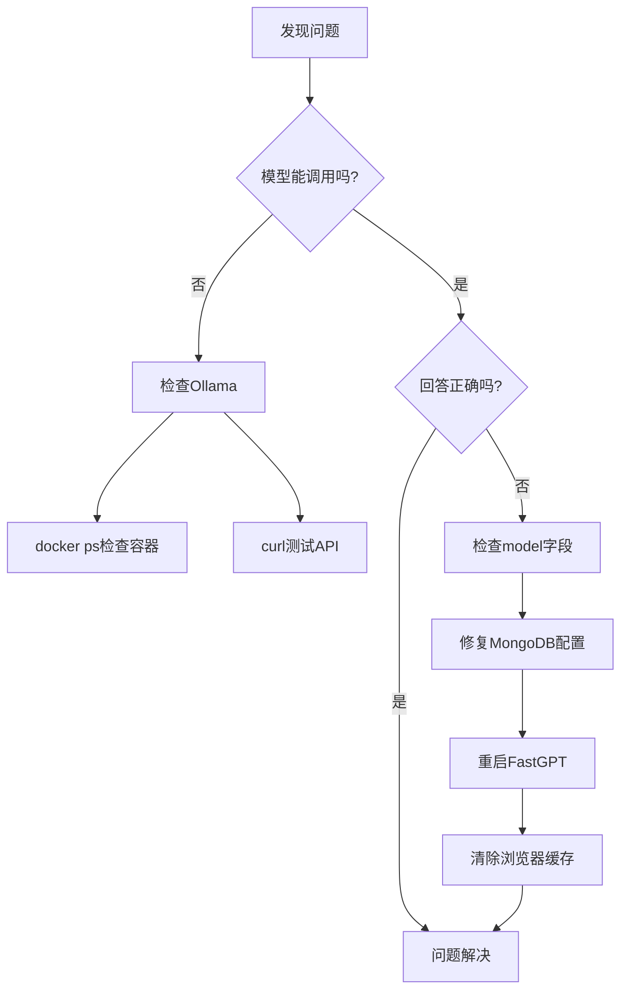

# FastGPT + Ollama 模型配置速查表

快速参考 - 配置和故障排除

## 📋 当前已配置模型

### LLM模型 (5个)

| 模型名称 | 显示名称 | 上下文 | 响应长度 | 用途 |
|---------|---------|-------|---------|------|
| `glm-4` | GLM-4 | 128K | 4K | 智谱AI官方 |
| `qwen3:8b` | 通义千问3-8B (Ollama) | 32K | 8K | 本地LLM |
| `deepseek-r1:8b` | DeepSeek-R1-8B (Ollama) | 32K | 8K | 推理模型 |
| `llama3:8b` | Llama3-8B (Ollama) | 8K | 4K | 通用对话 |
| `qwen2:7b` | 通义千问2-7B (Ollama) | 32K | 8K | 轻量级LLM |

### 向量模型 (3个)

| 模型名称 | 显示名称 | 维度 | 用途 |
|---------|---------|------|------|
| `bge-m3:latest` | BGE-M3 (Ollama) | 8192 | 知识库检索 |
| `mxbai-embed-large:latest` | MXBAI-Large (Ollama) | 512 | 快速嵌入 |
| `nomic-embed-text:latest` | Nomic-Embed-Text (Ollama) | 8192 | 文本向量化 |

## 🔧 快速命令

### 查看模型

```powershell
# Ollama中的模型
docker exec ollama-lightrag ollama list

# MongoDB中的模型
docker exec mongo mongo -u myusername -p mypassword --authenticationDatabase admin --eval "
db = db.getSiblingDB('fastgpt');
db.system_models.find({}, {model: 1, 'metadata.name': 1, 'metadata.isActive': 1}).pretty();
"

# FastGPT加载的模型
docker logs fastgpt 2>&1 | Select-String "Load models"
```

### 验证模型名称显示(PowerShell)

```powershell
# 导出到文件再读取,避免终端编码问题
docker exec mongo mongo -u myusername -p mypassword --authenticationDatabase admin `
  --eval "db = db.getSiblingDB('fastgpt'); db.system_models.find({}, {model: 1, 'metadata.name': 1}).toArray();" `
  | Out-File temp_models.json -Encoding UTF8

Get-Content temp_models.json -Encoding UTF8 | Select-String "name|model"
```

**验证结果应显示:**
| 模型ID | 显示名称 |
|--------|----------|
| glm-4 | GLM-4 |
| qwen3:8b | 通义千问3-8B (Ollama) |
| deepseek-r1:8b | DeepSeek-R1-8B (Ollama) |
| llama3:8b | Llama3-8B (Ollama) |
| qwen2:7b | 通义千问2-7B (Ollama) |
| bge-m3:latest | BGE-M3 (Ollama) |
| mxbai-embed-large:latest | MXBAI-Large (Ollama) |
| nomic-embed-text:latest | Nomic-Embed-Text (Ollama) |

### 测试模型

```powershell
# 直接测试Ollama API
curl http://localhost:11434/v1/chat/completions -H "Content-Type: application/json" -d '{"model":"deepseek-r1:8b","messages":[{"role":"user","content":"你好"}]}'

# 从容器内测试
docker exec fastgpt curl -s http://host.docker.internal:11434/v1/chat/completions -H "Content-Type: application/json" -d '{"model":"deepseek-r1:8b","messages":[{"role":"user","content":"你好"}]}'
```

### 添加新模型

```powershell
# 1. 下载模型
docker exec ollama-lightrag ollama pull llama3.1:8b

# 2. 添加到MongoDB
docker exec mongo mongo -u myusername -p mypassword --authenticationDatabase admin --eval "
db = db.getSiblingDB('fastgpt');
db.system_models.insertOne({
  model: 'llama3.1:8b',
  metadata: {
    model: 'llama3.1:8b',
    name: 'Llama 3.1 8B (Ollama)',
    type: 'llm',
    provider: 'openai',
    avatar: '/imgs/model/openai.svg',
    maxContext: 128000,
    maxResponse: 4000,
    isActive: true,
    requestUrl: 'http://host.docker.internal:11434/v1/chat/completions',
    censor: false,
    vision: false,
    datasetProcess: true,
    usedInClassify: true,
    usedInExtractFields: true,
    usedInToolCall: false,
    usedInQueryExtension: true
  }
});
"

# 3. 重启FastGPT
docker restart fastgpt
```

### 修复模型配置

```powershell
# 激活所有模型
docker exec mongo mongo -u myusername -p mypassword --authenticationDatabase admin --eval "
db = db.getSiblingDB('fastgpt');
db.system_models.updateMany({}, {\$set: {'metadata.isActive': true}});
"

# 修复URL
docker exec mongo mongo -u myusername -p mypassword --authenticationDatabase admin --eval "
db = db.getSiblingDB('fastgpt');
db.system_models.updateMany(
  {'metadata.requestUrl': {$regex: 'localhost:11434'}},
  {\$set: {'metadata.requestUrl': 'http://host.docker.internal:11434/v1/chat/completions'}}
);
"

# 修复model字段
docker exec mongo mongo -u myusername -p mypassword --authenticationDatabase admin --eval "
db = db.getSiblingDB('fastgpt');
db.system_models.updateOne(
  {model: 'deepseek-r1:8b'},
  {\$set: {
    model: 'deepseek-r1:8b',
    'metadata.model': 'deepseek-r1:8b'
  }}
);
"

# 重启
docker restart fastgpt
```

## ⚠️ 常见错误

### 1. 模型名称显示不正确

**症状**: FastGPT UI显示模型ID(如 `deepseek-r1:8b`)而不是配置的名称(如 `DeepSeek-R1-8B (Ollama)`)

**检查**:
```powershell
# 验证metadata.name配置
docker exec mongo mongo -u myusername -p mypassword --authenticationDatabase admin `
  --eval "db = db.getSiblingDB('fastgpt'); db.system_models.find({}, {model: 1, 'metadata.name': 1}).toArray();" `
  | Out-File temp_models.json -Encoding UTF8
Get-Content temp_models.json -Encoding UTF8
```

**解决**:
1. 如果name字段缺失,更新MongoDB配置
2. 重启FastGPT: `docker restart fastgpt`
3. 清除浏览器缓存(Ctrl+Shift+Delete)
4. 刷新页面验证

**注意**: FastGPT UI正确读取并显示 `metadata.name`,不显示 `model` 字段。

### 2. 模型回答身份错误

**症状**: 选择DeepSeek,回答说是通义千问

**检查**:
```powershell
# 检查model字段是否一致
docker exec mongo mongo -u myusername -p mypassword --authenticationDatabase admin --eval "
db = db.getSiblingDB('fastgpt');
db.system_models.findOne({model: 'deepseek-r1:8b'}, {model: 1, 'metadata.model': 1});
"
```

**解决**:
1. 确保 `model` 和 `metadata.model` 完全相同
2. 重启FastGPT: `docker restart fastgpt`
3. 清除浏览器缓存(Ctrl+Shift+Delete)
4. 重新登录FastGPT

### 3. Connection Error

**症状**: 模型无法调用,显示连接错误

**检查**:
```powershell
# 检查requestUrl
docker exec mongo mongo -u myusername -p mypassword --authenticationDatabase admin --eval "
db = db.getSiblingDB('fastgpt');
db.system_models.find({}, {'metadata.requestUrl': 1});
"

# 测试Ollama连接
curl http://localhost:11434/api/tags
```

**解决**:
1. URL必须是 `http://host.docker.internal:11434/v1/chat/completions`
2. 确保Ollama容器运行: `docker ps | grep ollama`
3. 不要有 `requestAuth` 字段

### 3. 模型未加载 (active: 0)

**症状**: 日志显示 "active: 0"

**检查**:
```powershell
docker exec mongo mongo -u myusername -p mypassword --authenticationDatabase admin --eval "
db = db.getSiblingDB('fastgpt');
db.system_models.find({}, {'metadata.isActive': 1});
"
```

**解决**:
```powershell
# 激活所有模型
docker exec mongo mongo -u myusername -p mypassword --authenticationDatabase admin --eval "
db = db.getSiblingDB('fastgpt');
db.system_models.updateMany({}, {\$set: {'metadata.isActive': true}});
"
docker restart fastgpt
```

## 📝 模型配置模板

### LLM模型模板

```javascript
{
  model: "模型名称:版本",  // 必须与ollama list一致
  metadata: {
    model: "模型名称:版本",  // 与上面相同
    name: "显示名称",
    type: "llm",
    provider: "openai",
    avatar: "/imgs/model/openai.svg",
    maxContext: 8192,
    maxResponse: 4000,
    isActive: true,  // 必须为true
    requestUrl: "http://host.docker.internal:11434/v1/chat/completions",
    censor: false,
    vision: false,
    datasetProcess: true,
    usedInClassify: true,
    usedInExtractFields: true,
    usedInToolCall: false,  // Ollama模型建议false
    usedInQueryExtension: true
  }
}
```

### 向量模型模板

```javascript
{
  model: "模型名称:版本",
  metadata: {
    model: "模型名称:版本",
    name: "显示名称",
    type: "embedding",
    provider: "openai",
    avatar: "/imgs/model/embedding.svg",
    maxToken: 8192,
    weight: 100,
    isActive: true,
    requestUrl: "http://host.docker.internal:11434/api/embeddings"
  }
}
```

## 🔗 相关文档

- 主文档: [DOCKER_DEPLOYMENT_SOLUTION.md](../DOCKER_DEPLOYMENT_SOLUTION.md)
- Ollama模型库: https://ollama.ai/library
- FastGPT文档: https://doc.fastgpt.in/

## 🆘 故障排除流程



---

最后更新: 2025-12-16
